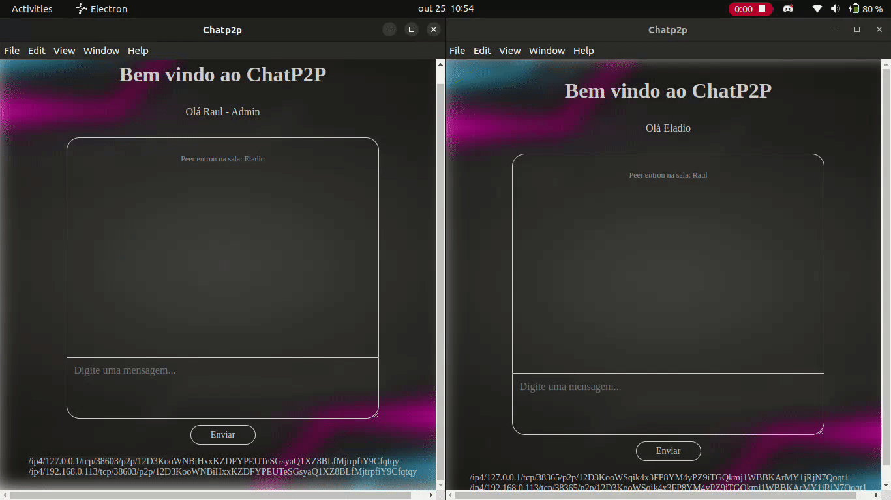

# chat-p2p

Este projeto implementa uma aplicação de chat Peer-to-Peer(P2P), o chat possui uma quantidade variável de usuários e possui um criador, que tem responsabilidade de administrar o chat. A rede suporta a eventual queda dos nós, inclusive a saída do criador da rede, permitindo que outro nó passe a ser o administrador.

A interface gráfica do chat é implementada utlizando a biblioteca [Electron](https://www.electronjs.org/) enquantos detalhes de conexão a rede e protocolo de mensagens são estabelecidos utilizado a stack de bibliotecas do [libp2p2](https://libp2p.github.io/js-libp2p/).

## Setup 

Primeiro, instale a versão mais recente do nodejs(versão sugerida 20.18 LTS).

Em seguida, instale as dependências com `npm install`.

Para executar o criador da sala execute `npm start <nome-do-criador>`.

O comando a cima irá imprimir o endereço do criador, copie esse endereço, ele será usado para entrar na sala no comando abaixo.

Para conectar um peer na sala execute `npm start <nome-do-peer> <endereco-criador>`.

Para desconectar um nó da rede basta fechar a janela do nó. Ao fechar os outros nós serão comunicados da saída do nó e farão os ajustes necessários nos seus dados internos.
